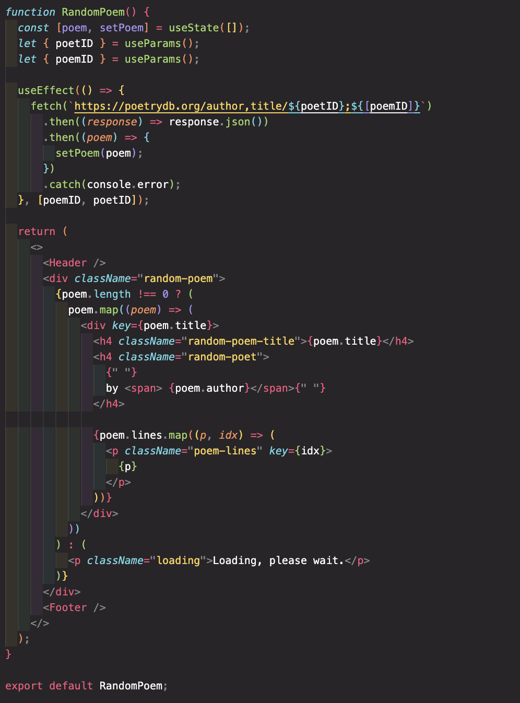
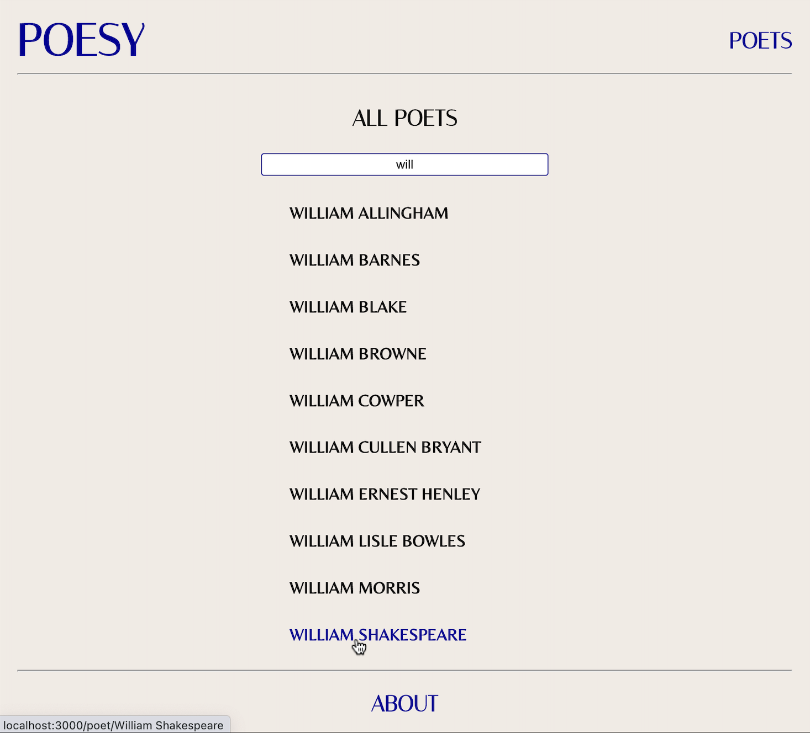

# Project 2: Readme

# Description

As part of our second project on General Assembly’s Software Engineering course, we were assigned a week to create a React application that uses a public API. I undertook this project solo and decided to go with a website that showcases poetry. I used the PoetryDB API which can be accessed here: https://poetrydb.org

The technical requirements set for the project included the need to:

1. Consume a public API – this could be anything but it must make sense for your project.
2. The app should include a router - with several “pages”.
3. Include wireframes - that you designed before building the app.
4. Have semantically clean HTML - you make sure you write HTML that makes structural sense rather than thinking about how it might look, which is the job of CSS.
5. Be deployed online and accessible to the public.

## Deployment link

The POESY application can be accessed here:

## Getting Started/Code Installation

To run the project in your browser following download, enter the following commands in your terminal:

1. `npm install`
2. `npm start`

## Planning

The application was split into four core components; homepage, poets, poems, and about. Additional components were created for the header, footer, and random poem.

Excalidraw was used to plan and sketch the design of the application:

## Build/Code Process

The application was first set up with routes in App.js for the pages that users would navigate to. This includes pages for the poets and their poems, the about section, a return to the homepage by clicking the POESY header title, and a catch-all for entering a route-less URL redirects to the homepage. API calls for authors and a random poem were also lifted to App.js, which were passed as props to various components:

The homepage component contains two main sections; a random poem and featured poets. A preview of a random poem that changes on refresh is shown on the left of the homepage. Users can click the “read more” button to access the poem in full, which links to the random poem component:

The featured poets section displays four clickable poets that link to the poet’s page with their poems. The featured section was hard coded with the intention of routinely updating the featured poets.

The poets component contains a list of all poets available on the API in alphabetical order and a search function that filters this list based on the poet’s name.

As shown here, the filter’s use of the includes and lowercase methods allows for a returned list of clickable authors that include the entered letters in the search bar:

Poets clicked on will link to the poet details component, which showcases a collection of the author’s poems rendered via an API call.

The final core component is the about section is accessed via the footer component. This section provides a quote about the power and importance of poetry and a summary of the contents found on the website.

## Challenges

Initially, I sought to make a call to the API when a user searched for a poet. However, this posed a challenge because of the API's unexpected returns. This search approach was, therefore, discarded in favour of a less complicated filtering method on the list of poets within the poets component.

Another challenge has been generating a unique key for the poems as its generation is a nested map. As of currently, this challenge persists and will be tackled at a later date.

## Wins

I’m pretty happy with the application’s styling choices! I spent quite some time planning out the layout, font type, and colourings for the background and font.

## Key Learnings/Takeaways

This project has been key in not only solidifying my knowledge of React and using APIs, but also in further strengthening my knowledge and skills in using HTML and CSS, and manipulating arrays.

## Bugs

No bugs to report!

## Future Improvements

Future enhancements will include adding a save functionality for particular poems.
